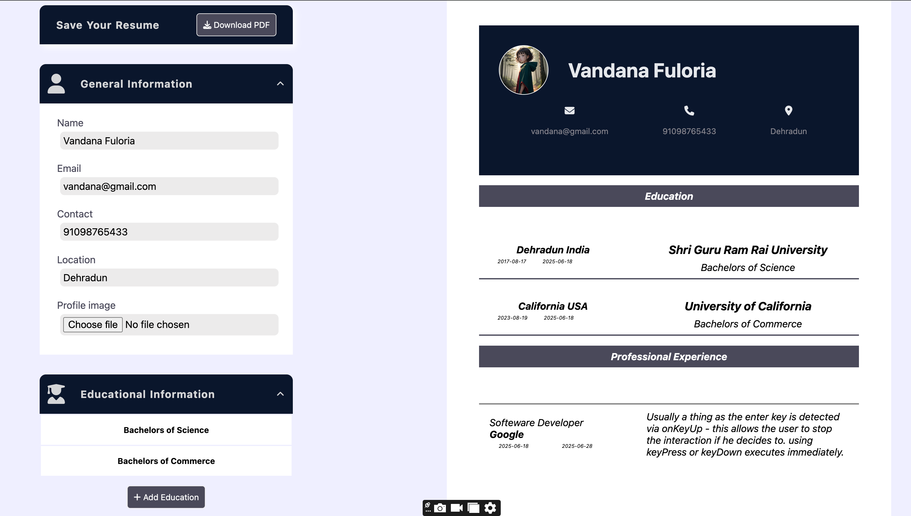

# 📝 Resume Builder App

This is a Resume Builder application developed using React.js and bundled with Vite for fast and efficient development. The application is designed with a professional theme, focusing on a clean, sleek, and responsive UI that ensures a smooth user experience across all devices.

# 🚀 Features

1. Live Preview: As you type your resume content, you can simultaneously preview the formatted resume in real-time.

2. User-Friendly Interface: Simple and intuitive design makes it easy to build resumes quickly.

3. Responsive Layout: Fully responsive across desktop, tablet, and mobile screens.

4. Fast Performance: Thanks to Vite, the app offers lightning-fast development and loading speeds.

# 🔧 Technologies Used

 Component-based UI development

 Vite – Modern bundler for super-fast builds and HMR

Pure CSS

JavaScript (ES6+)

📸 **Here are Some glimps**


📸 **Each section has a form**




## [👉 ---> Link](https://vandanafuloria.github.io/CV-builder-/)

### How to Use

`_Clone the Repository_`

```
git clone https://github.com/vandanafuloria/resume-builder.git
```

`_Dependencies_`

```
npm i
```

`_Start the Development Server_`

```
npm run dev
```

#### Contact Me : vandanafuloria02@gmail.com
